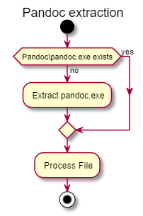
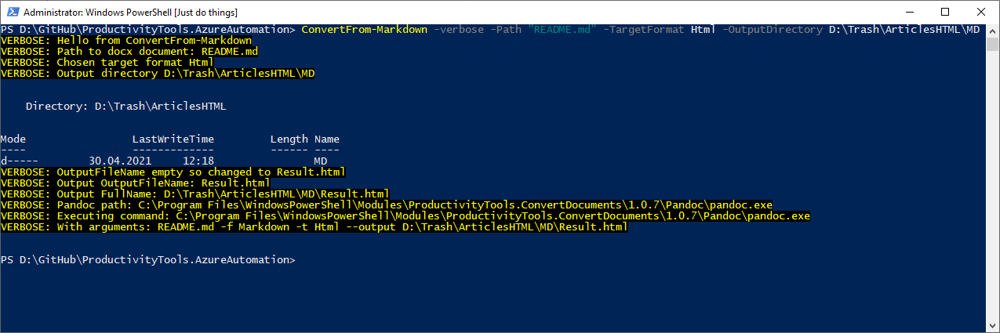

<!--Category:PowerShell--> 
 <p align="right">
    <a href="https://www.powershellgallery.com/packages/ProductivityTools.ConvertDocuments/"></a>
    <a href="http://productivitytools.tech/convert-documents/"><a> 
    <a href="https://github.com/pwujczyk/ProductivityTools.ConvertDocuments/"></a>
</p>
<p align="center">
    <a href="http://http://productivitytools.tech/">
        
    </a>
</p>

   
# Convert Documents

Module is depreciated

I found module [**ConvertFrom-Markdown**](https://docs.microsoft.com/en-us/powershell/module/microsoft.powershell.utility/convertfrom-markdown?view=powershell-7.2) from Microsoft Powershell Utility. I encourage everyone to use it. 

I will stop update this module, as Microsoft module generates nicer html.
<!--more-->

### Pandoc html
```html
<p>Library generates connection string from params.</p>

<p>It exposes two methods</p>
<ul>
<li>GetSqlDataSourceConnectionString - creates connection string to server</li>
</ul>
<div class="sourceCode" id="cb1"><pre class="sourceCode c#"><code class="sourceCode cs"><span id="cb1-1"><a href="#cb1-1"></a><span class="dt">var</span> x=ConnectionStringLight.<span class="fu">GetSqlDataSourceConnectionString</span>(<span class="st">&quot;.&quot;</span>);</span>
<span id="cb1-2"><a href="#cb1-2"></a>Assert.<span class="fu">AreEqual</span>(x, <span class="st">&quot;Data Source=.;Integrated Security=True&quot;</span>);</span></code></pre></div>
<ul>
<li>GetSqlServerConnectionString - creates connection string to database on the server</li>
</ul>
<div class="sourceCode" id="cb2"><pre class="sourceCode c#"><code class="sourceCode cs"><span id="cb2-1"><a href="#cb2-1"></a><span class="dt">var</span> y = ConnectionStringLight.<span class="fu">GetSqlServerConnectionString</span>(<span class="st">&quot;.&quot;</span>, <span class="st">&quot;dbName&quot;</span>);</span>
<span id="cb2-2"><a href="#cb2-2"></a>Assert.<span class="fu">AreEqual</span>(y, <span class="st">&quot;Data Source=.;Initial Catalog=dbName;Integrated Security=True&quot;</span>);</span></code></pre></div>
```

### Microsoft html
```html
<p>Library generates connection string from params.</p>
<!--more-->
<p>It exposes two methods</p>
<ul>
<li>GetSqlDataSourceConnectionString - creates connection string to server</li>
</ul>
<pre><code class="language-c#">var x=ConnectionStringLight.GetSqlDataSourceConnectionString(&quot;.&quot;);
Assert.AreEqual(x, &quot;Data Source=.;Integrated Security=True&quot;);
</code></pre>
<ul>
<li>GetSqlServerConnectionString - creates connection string to database on the server</li>
</ul>
<pre><code class="language-c#">var y = ConnectionStringLight.GetSqlServerConnectionString(&quot;.&quot;, &quot;dbName&quot;);
Assert.AreEqual(y, &quot;Data Source=.;Initial Catalog=dbName;Integrated Security=True&quot;);
</code></pre>
```

## Readme

Module allows to convert document from Docx and MD format into html or markdown format.

<!--more-->

Module uses **Pandoc** application to perform conversion. It contains zipped version of the **Pandoc** and first step before running the script is to validate if archive is extracted.



## Methods
- ConvertFrom-DocxPandoc - allows to convert documents to **Html** and **Markdown**
- ConvertFrom-MarkdownPandoc - allows to convert documents to **Html** and **Docx**

## Parameters

- Path - path to source document (Docx or Markdown)
- TargetFormat - target format of the document **Html**, **Docx** or **Markdown**
- OutputDirectory - directory where output file will be placed
- OutputFileName - name of the output file
- ExtractImages - if used images will be extracted from the document to files

```powershell
ConvertFrom-MarkdownPandoc -Verbose -Path "README.md" -TargetFormat Html -OutputDirectory D:\Trash\ArticlesHTML\MD
```

<!--og-image-->



